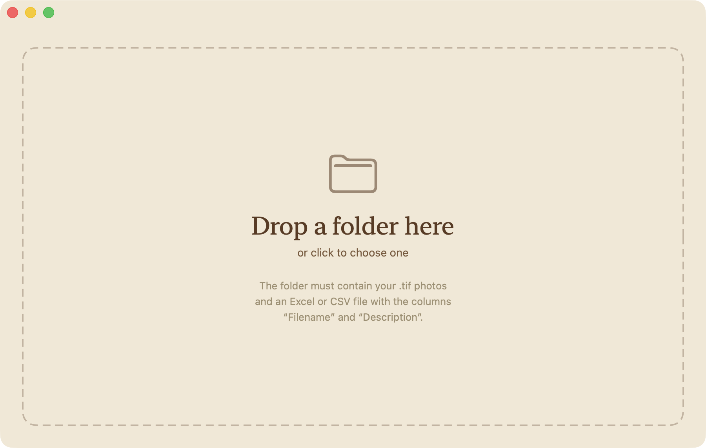

  

<h1 align="center">Imprint</h1>

<em>Caption your TIFFs in a single drop.</em>

  <a href="https://github.com/jerefrer/imprint/releases/latest"><strong>Download Imprint →</strong></a>

  

---

You have a folder of TIFFs. You have a spreadsheet of captions.
**Imprint slides one into the other** — no terminal, no command line, just a window.

## How it works

**1. Put your photos and your caption file in the same folder.**
The file — Excel (`.xlsx`) or CSV — needs two columns: `Filename` and `Description`.

**2. Drag the folder into Imprint.**
Or click to choose it.

**3. Done.**
The caption is written into each photo and appears in the *Description* field of Bridge, Photoshop, Lightroom, and at agencies.

## Install

Download **Imprint.dmg** from the [releases page](https://github.com/jerefrer/imprint/releases), open it, drag the icon into Applications. That's it.

> Apple Silicon Mac · macOS 14 or later.

## Support

Imprint is free. If it earns its place in your workflow, you can [support my work](https://frerejeremy.me). Most of what I build tries to help the Dharma flourish — translation, publication, the practical work that surrounds them — alongside a few compassionate initiatives I believe in.

&nbsp;<a href="https://frerejeremy.me"><em>Jérémy Frère</em></a>
